# Expense Tracker

This is a simple expense tracker made in Codeigniter HMVC

## Table of Contents

- [Introduction](#introduction)
- [Features](#features)
- [Installation](#installation)
- [Database Setup and Management](#database-setup-and-management)
- [Running the Project](#running-the-project)
- [Technologies Used](#technologies-used)
- [Assumptions Made](#assumptions-made)
- [License](#license)

## Introduction

This is a simple expense tracker application made in Codeigniter HMVC

## Features

- Easy management of content
- Interactive UI built with Codeigniter
- Easy setup and customization

## Installation

To get started with the project, follow these steps to set it up locally:

1. **Clone the repository:**

   ```bash
   https://github.com/j3rryl/expense-tracker.git
   cd expense-tracker
   ```

2. **Install the required composer packages:**

   ```bash
   composer install
   ```

# Database Setup and Management

This project utilizes [CodeIgniter Query Builder](https://codeigniter.com/user_guide/database/query_builder.html) as an ORM for database management. Follow the instructions below to set up, migrate, and seed the database.

1. **Prerequisites:**
   Ensure you have the necessary environment variables configured for database access.

   ```bash
   cp .env.example .env
   ```

2. **Setup Simpletine:**
   Run the following command but **`cautiously`** so as to not overwrite existing configurations:

   ```bash
   php spark simpletine:setup
   ```

   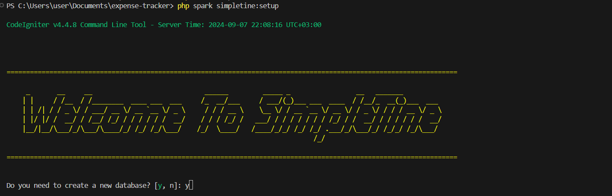

- Enter y and press `Enter`

  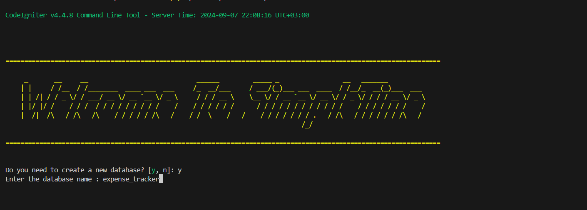

- Enter a new database name and press `Enter`, in this case we are using expense_tracker.
  This is very crucial, **ensure the database name matches the one in the .env** here to avoid errors in the next setup.

  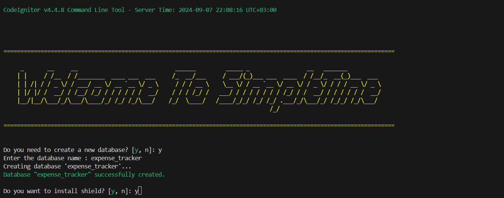

- Enter y and press `Enter`

  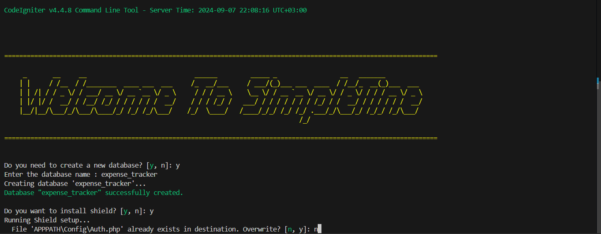

- This is very crucial, **ensure you have pressed n** here to avoid overwriting existing configurations.
  Enter **n** and press `Enter`

  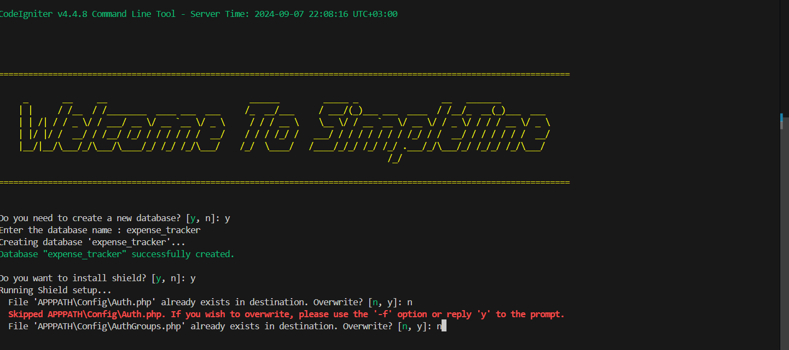

- This is very crucial, **ensure you have pressed n** here to avoid overwriting existing configurations.
  Enter **n** and press `Enter`

  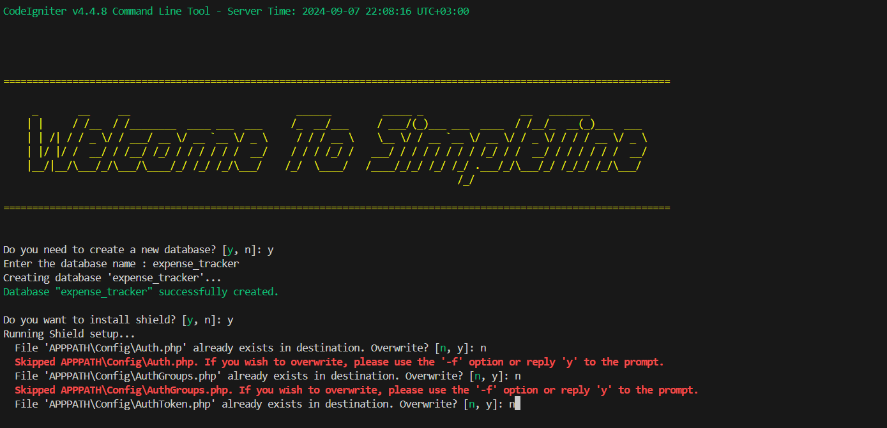

- This is very crucial, **ensure you have pressed n** here to avoid overwriting existing configurations.
  Enter **n** and press `Enter`

  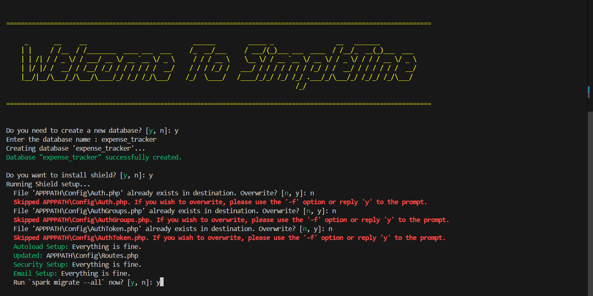

- Enter y and press `Enter`

  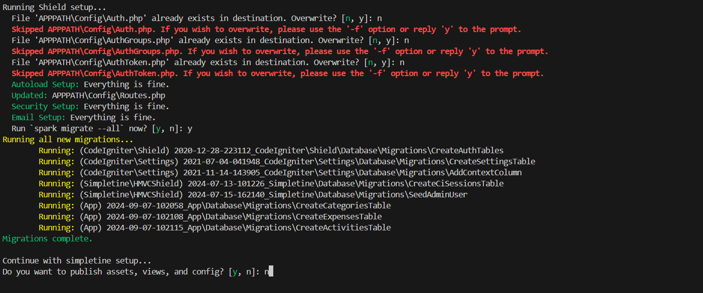

- This is very crucial, **ensure you have pressed n** here to avoid overwriting existing assets.
  Enter **n** and press `Enter`

- 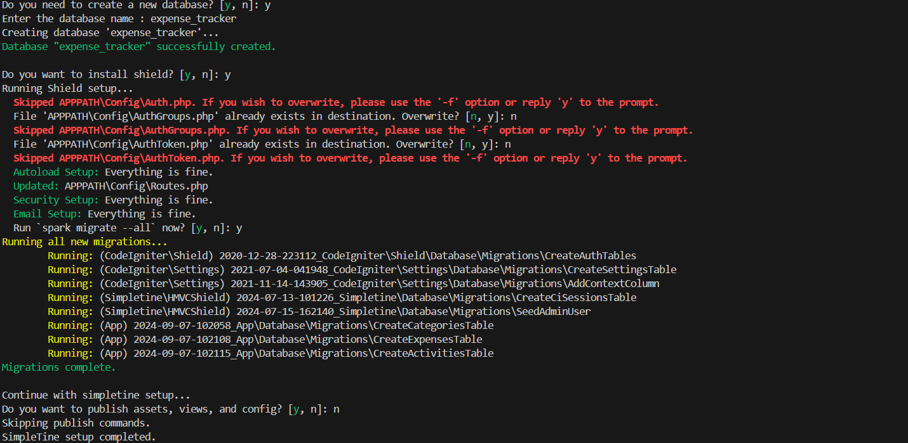

- If all goes well, that should be the output, with all the prompts used displayed.

3. **Running the migrations:**
   To apply all pending migrations and set up the initial database schema, run:

   ```bash
   php spark migrate
   ```

4. **Seeding the database:**
   To populate the database with seed data, use:

   ```bash
   php spark db:seed DatabaseSeeder
   ```

## Running the Project

To run the project in development mode:

1. **Start the Codeigniter server:**

```bash
php spark serve
```

2. **Open localhost:8080**

- The project should be running here.

  

3. **Click login to login**

   

4. **Login as as administrator**

- To log in as an administrator, use the following credentials:  
   `email: super@admin.com`  
   `password: password`

  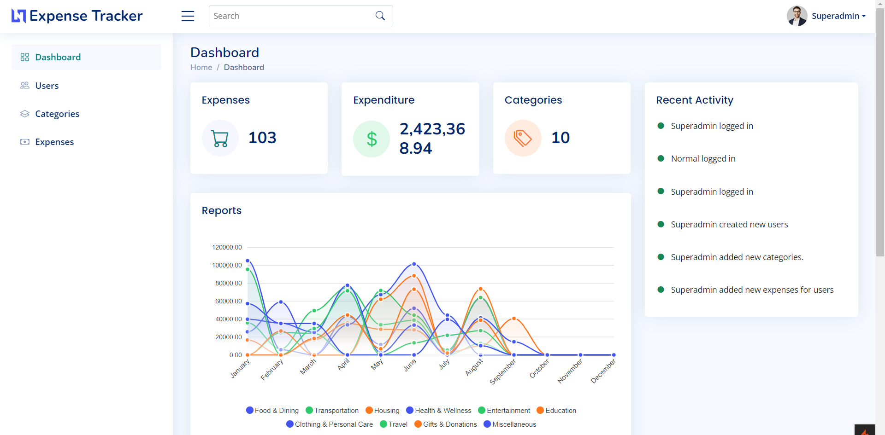

5. **Login as a normal user**

- To log in as a norma user, use the following credentials:  
   `email: normal@normal.com`  
   `password: password`

  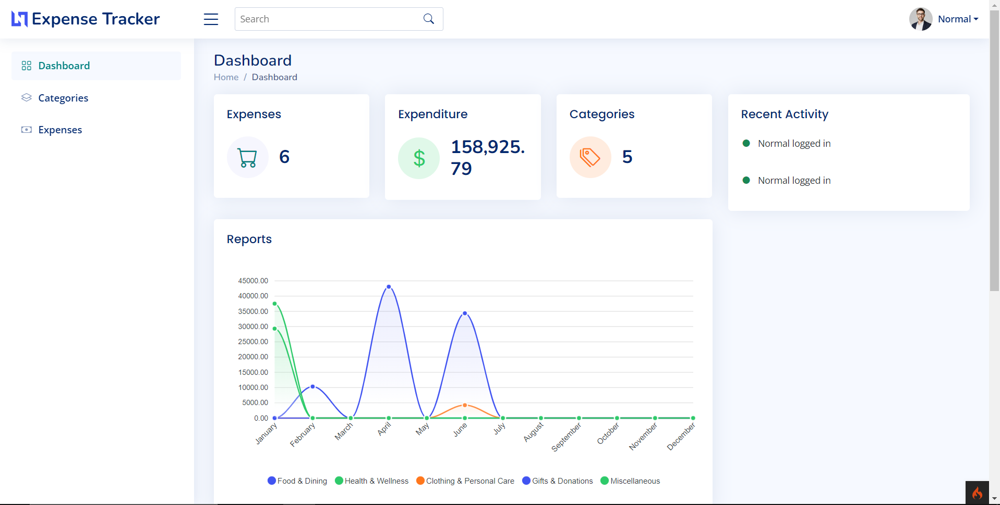

6. **Create an expense**

- To create an expense go to expenses page and click `New Expense`.

  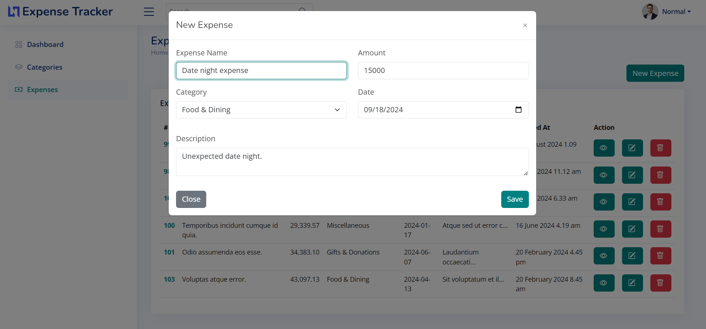

## Assumptions Made

1. Pagination: It is assumed that pagination will be implemented at a later stage to handle large sets of data.
2. Soft Deletes: Soft delete functionality is used throughout the system. Soft deleted records are labeled as `archived` and stored in the `deleted_at` column.
3. PHP Requirements: The system requires PHP version greater than 7.
4. PHP Intl Extension: The PHP Internationalization extension `(intl)` must be enabled in the php.ini configuration file.
5. Server Environment: Apache XAMPP with MySQL is used as the server environment.

## Technologies Used

- [Codeigniter](https://codeigniter.com/)
- [Bootstrap-5](https://getbootstrap.com/docs/5.0/getting-started/introduction/)

## License

Distributed under the MIT License. See `LICENSE` for more information.
